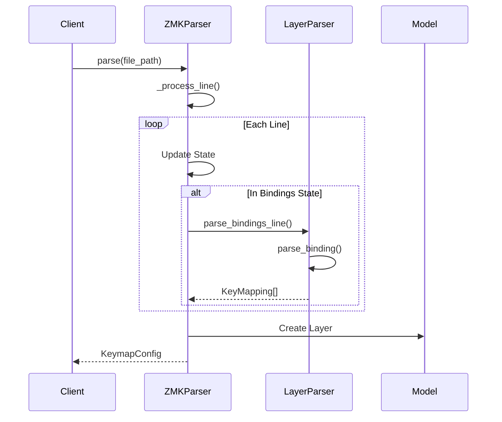

# ZMK to Kanata Converter

A tool to convert ZMK keymap files (generated by Nick's Keymap Editor) into Kanata configuration files.

## Development Setup

1. Install uv (if not already installed):
```bash
pip install uv
```

2. Create and activate virtual environment:
```bash
uv venv zmk-kanata-env
source zmk-kanata-env/bin/activate  # On macOS/Linux
```

3. Install dependencies:
```bash
uv pip install pytest
```

## Running Tests

```bash
pytest
```

## Project Structure

```
converter/
├── parser/         # ZMK file parsing
├── transformer/    # Convert to Kanata format
├── output/        # File writing
├── model/         # Data models
└── tests/         # Unit tests
```

## Architecture and Design

### Parser Architecture

The parser follows a state machine pattern to handle complex ZMK file parsing:

```
ZMKParser
├── LayerParser - Handles parsing of individual layers and bindings
├── GlobalSettingsParser - Handles parsing of global settings (planned)
└── MacroParser - Handles parsing of macro definitions (planned)
```

#### State Machine Flow

1. **Initial State**: Start of file parsing
2. **Root State**: Inside the root node
3. **Keymap State**: Inside the keymap section
4. **Layer State**: Inside a layer definition
5. **Bindings State**: Inside a bindings block

Example state transitions:
```
INITIAL -> IN_ROOT:     When "/ {" is encountered
IN_ROOT -> IN_KEYMAP:   When "keymap {" is encountered
IN_KEYMAP -> IN_LAYER:  When "*_layer {" is encountered
IN_LAYER -> IN_BINDINGS: When "bindings = <" is encountered
IN_BINDINGS -> IN_LAYER: When ">" is encountered
IN_LAYER -> IN_KEYMAP:  When "};" is encountered
```

#### Sequence Diagram



### Key Components

1. **LayerParser**
   - Handles parsing of individual key bindings
   - Supports sticky keys, transparent keys, and regular keys
   - Extensible for new binding types

   Example binding parsing:
   ```python
   # Input line: "&sk LSHIFT  &kp A  &trans"
   bindings = layer_parser.parse_bindings_line(line)
   # Result: [StickyKeyBinding("LSHIFT"), KeyMapping("A"), KeyMapping("trans")]
   ```

2. **ZMKParser**
   - Manages overall parsing process
   - Implements state machine logic
   - Coordinates between different parsers

   Example state handling:
   ```python
   def _process_line(self, line: str) -> None:
       if self.state == ParserState.IN_BINDINGS:
           if '>' in line:
               self._add_bindings_line(line)
               self.state = ParserState.IN_LAYER
   ```

### Best Practices

1. **Single Responsibility Principle**
   - Each class has a single, well-defined responsibility
   - Clear separation between parsing, transformation, and output

   Example:
   ```python
   class LayerParser:
       """Handles only layer-specific parsing."""
       def parse_binding(self, binding: str) -> KeyMapping:
           pass

   class GlobalSettingsParser:
       """Handles only global settings parsing."""
       def parse_settings(self, content: str) -> GlobalSettings:
           pass
   ```

2. **State Pattern**
   - Explicit state transitions
   - Clear state-dependent behavior
   - Easy to add new states and transitions

3. **Error Handling**
   - Specific error messages for each failure case
   - Graceful handling of malformed input
   - Clear validation at each parsing stage

   Example:
   ```python
   def parse_binding(self, binding: str) -> KeyMapping:
       if not binding:
           raise ValueError("Empty binding")
       if binding.count('&') > 1:
           raise ValueError(f"Invalid binding format: {binding}")
       # ... rest of parsing logic
   ```

4. **Extensibility**
   - Easy to add new binding types
   - Modular design for new features
   - Clear extension points for future enhancements

### Testing Guidelines

1. **Unit Tests**
   - Test each parser component in isolation
   - Cover all state transitions
   - Test error cases thoroughly

   Example:
   ```python
   def test_layer_parser():
       parser = LayerParser()
       # Test basic binding
       assert parser.parse_binding("&kp A").key == "A"
       # Test sticky key
       assert isinstance(parser.parse_binding("&sk LSHIFT"), StickyKeyBinding)
       # Test error case
       with pytest.raises(ValueError):
           parser.parse_binding("&invalid_binding")
   ```

2. **Integration Tests**
   - Test complete file parsing
   - Verify layer structure
   - Check binding conversions

3. **End-to-End Tests**
   - Test with real ZMK files
   - Verify Kanata output
   - Check error handling

4. **Test Fixtures**
   - Maintain comprehensive test cases
   - Include edge cases
   - Document test purpose

Example test fixture:
```python
# test_sticky_keys.py
def test_sticky_key_advanced(temp_test_dir):
    """Test advanced sticky key features."""
    fixture_path = "test_sticky_keys.dtsi"
    kanata_file = temp_test_dir / "output.kbd"
    
    exit_code = main([fixture_path, str(kanata_file)])
    assert exit_code == 0
    
    content = kanata_file.read_text()
    assert "sticky-lsft" in content
    assert "sticky-f1" in content
```

## Current Status

Initial development - Parser refactoring in progress:

- [x] Basic state machine implementation
- [x] Layer parsing
- [x] Sticky key support
- [ ] Global settings parser
- [ ] Macro support
- [ ] Error handling improvements
- [ ] Validation enhancements

## Contributing

When contributing to the parser:

1. Follow the state machine pattern for new parsing features
2. Add appropriate tests for new functionality
3. Update documentation for new features or changes
4. Ensure backward compatibility with existing keymaps
5. Run the test suite before submitting changes

### Pull Request Guidelines

1. Include test cases for new features
2. Update sequence diagrams if flow changes
3. Document state transitions for new states
4. Add examples for new functionality
5. Verify backward compatibility