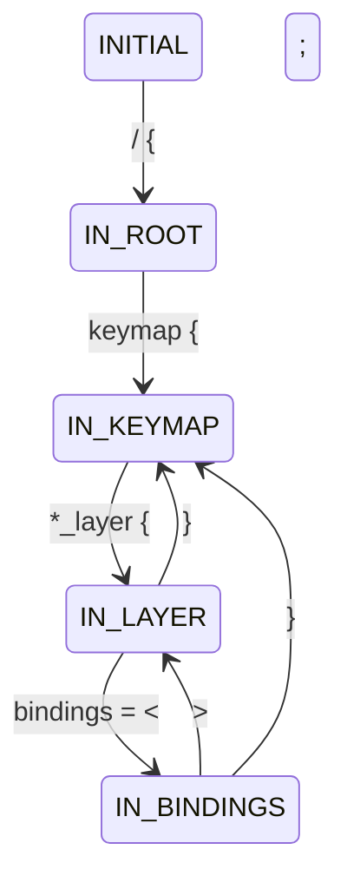

# ZMK Parser State Machine

The ZMK parser uses a state machine to parse ZMK keymap files. This document describes the states, transitions, and their responsibilities.

## States

### INITIAL
- Initial state when parser is created
- Waits for the root node `/ {`
- Valid transitions: → IN_ROOT

### IN_ROOT
- Inside the root node
- Parses global settings (tap-time, hold-time)
- Waits for keymap node `keymap {`
- Valid transitions: → IN_KEYMAP

### IN_KEYMAP
- Inside the keymap node
- Waits for layer definitions `*_layer {`
- Valid transitions: → IN_LAYER

### IN_LAYER
- Inside a layer definition
- Parses layer name
- Waits for bindings or layer end
- Valid transitions: → IN_BINDINGS, → IN_KEYMAP

### IN_BINDINGS
- Inside a bindings block
- Parses key bindings
- Valid transitions: → IN_LAYER, → IN_KEYMAP

## State Transitions



## Example Flow

Given this ZMK keymap:
```zmk
/ {                    # INITIAL → IN_ROOT
    tap-time = <200>; # Parse global setting
    keymap {          # IN_ROOT → IN_KEYMAP
        default_layer {    # IN_KEYMAP → IN_LAYER
            bindings = <   # IN_LAYER → IN_BINDINGS
                &kp A     # Parse binding
                &kp B     # Parse binding
            >;            # IN_BINDINGS → IN_LAYER
        };               # IN_LAYER → IN_KEYMAP
    };
};
```

## Error Handling

The parser enforces these rules:
1. State transitions must follow the valid paths
2. Layer names must be non-empty and end with "_layer"
3. Bindings must be properly formatted
4. Layers must have bindings
5. No nested layers allowed

## Debugging

The parser uses Python's logging module for debug output. To enable debug logging:

```python
import logging
logging.basicConfig(level=logging.DEBUG)
```

This will show state transitions, layer parsing, and binding parsing details.
