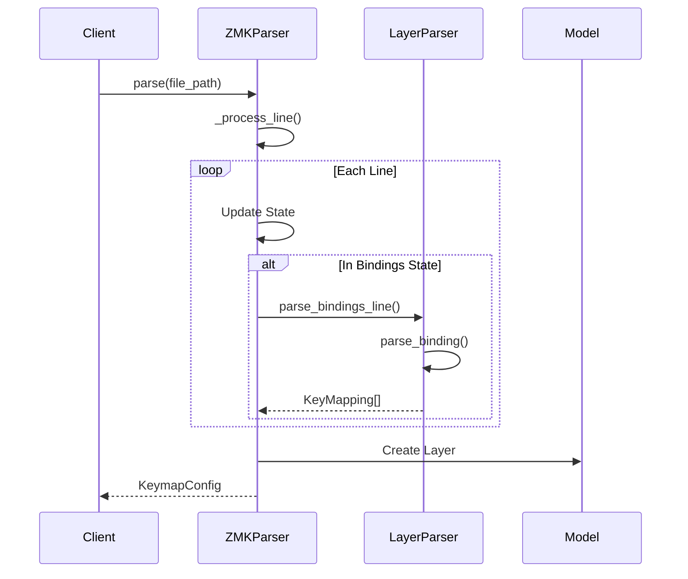

# ZMK to Kanata Converter Development Plan

## Project Architecture

### Parser Architecture

The parser follows a state machine pattern to handle complex ZMK file parsing:

```
ZMKParser
├── LayerParser - Handles parsing of individual layers and bindings
├── GlobalSettingsParser - Handles parsing of global settings (planned)
└── MacroParser - Handles parsing of macro definitions (planned)
```

#### State Machine Flow

1. **Initial State**: Start of file parsing
2. **Root State**: Inside the root node
3. **Keymap State**: Inside the keymap section
4. **Layer State**: Inside a layer definition
5. **Bindings State**: Inside a bindings block

Example state transitions:
```
INITIAL -> IN_ROOT:     When "/ {" is encountered
IN_ROOT -> IN_KEYMAP:   When "keymap {" is encountered
IN_KEYMAP -> IN_LAYER:  When "*_layer {" is encountered
IN_LAYER -> IN_BINDINGS: When "bindings = <" is encountered
IN_BINDINGS -> IN_LAYER: When ">" is encountered
IN_LAYER -> IN_KEYMAP:  When "};" is encountered
```

#### Sequence Diagram



## Project Structure

```
converter/
├── __init__.py
├── model/           # Data models
├── parser/         # Input parsing
├── transformer/    # Output generation
├── output/        # File writing
├── samples/       # Example files
└── tests/         # Test suite
```

## Implementation Status

### Core Infrastructure
- [x] Project structure setup
- [x] Basic test framework
- [x] Sample ZMK files
- [x] CI/CD pipeline

### Basic Features
- [x] Parse basic key definitions
- [x] Handle layer declarations
- [x] Support basic modifiers
- [x] Generate Kanata output
- [x] Command-line interface

### Advanced Features
- [x] Hold-tap behaviors
  - [x] Basic hold-tap functionality
  - [x] Custom behaviors (hm, hs, td)
  - [x] Advanced features (trigger positions, retro-tap)
- [x] Complex modifier combinations
  - [x] Nested modifiers
  - [x] Multi-modifier combinations
- [x] Media and special keys
- [x] Unicode input support
- [x] Macro support
  - [x] Basic macros
  - [x] Parameterized macros
  - [x] Complex macros with timing

### Testing Infrastructure
- [x] Unit tests
- [x] Integration tests
- [x] End-to-end tests
- [x] Real-world keymap tests
  - [x] QWERTY layout
  - [x] Colemak layout
  - [x] Split keyboards
  - [x] Ergonomic layouts

## Current Development Focus

### Task 27: Fix Remaining Linter Errors
- [x] Fix whitespace issues
- [x] Add missing newlines
- [x] Fix unused imports
- [ ] Fix spacing between class definitions
- [ ] Fix remaining import issues
- [ ] Fix long lines

### Task 31: Regression Testing
- [ ] Add tests for fixed issues
- [ ] Implement automated regression testing
- [ ] Document test coverage requirements

### Task 32: Parser Refactoring
- [x] Implement state machine pattern
- [x] Add explicit state transitions
- [x] Improve error handling
- [ ] Add global settings parser
- [ ] Add macro parser
- [ ] Enhance validation

## Future Tasks

### Task 33: Documentation Enhancement
- [ ] Add API documentation
- [ ] Create developer guide
- [ ] Add more code examples
- [ ] Document testing strategy
- [ ] Create contribution workflow guide

### Task 34: Performance Optimization
- [ ] Profile parser performance
- [ ] Optimize state transitions
- [ ] Reduce memory usage
- [ ] Add performance benchmarks
- [ ] Document performance requirements

### Task 35: Error Handling Enhancement
- [ ] Add more specific error types
- [ ] Improve error messages
- [ ] Add error recovery strategies
- [ ] Document error handling patterns
- [ ] Add error handling tests

## Development Guidelines

### Best Practices

1. **Single Responsibility Principle**
   - Each class has a single, well-defined responsibility
   - Clear separation between parsing, transformation, and output

2. **State Pattern**
   - Explicit state transitions
   - Clear state-dependent behavior
   - Easy to add new states and transitions

3. **Error Handling**
   - Specific error messages for each failure case
   - Graceful handling of malformed input
   - Clear validation at each parsing stage

4. **Extensibility**
   - Easy to add new binding types
   - Modular design for new features
   - Clear extension points for future enhancements

### Pull Request Guidelines

1. Include test cases for new features
2. Update sequence diagrams if flow changes
3. Document state transitions for new states
4. Add examples for new functionality
5. Verify backward compatibility

### Testing Guidelines

1. **Unit Tests**
   - Test each parser component in isolation
   - Cover all state transitions
   - Test error cases thoroughly

2. **Integration Tests**
   - Test complete file parsing
   - Verify layer structure
   - Check binding conversions

3. **End-to-End Tests**
   - Test with real ZMK files
   - Verify Kanata output
   - Check error handling

4. **Test Fixtures**
   - Maintain comprehensive test cases
   - Include edge cases
   - Document test purpose