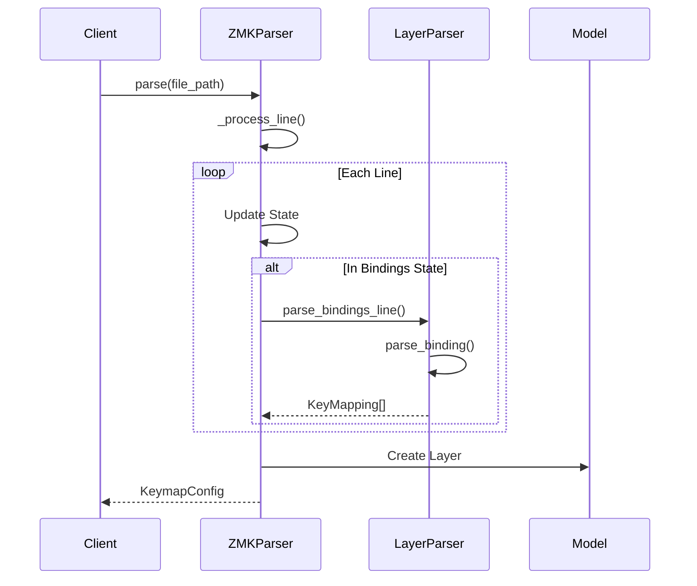

# ZMK to Kanata Converter Development Plan

## Project Architecture

### Parser Architecture

The parser follows a state machine pattern to handle complex ZMK file parsing:

```
ZMKParser
├── LayerParser - Handles parsing of individual layers and bindings
├── GlobalSettingsParser - Handles parsing of global settings (planned)
└── MacroParser - Handles parsing of macro definitions (planned)
```

#### State Machine Flow

1. **Initial State**: Start of file parsing
2. **Root State**: Inside the root node
3. **Keymap State**: Inside the keymap section
4. **Layer State**: Inside a layer definition
5. **Bindings State**: Inside a bindings block

Example state transitions:
```
INITIAL -> IN_ROOT:     When "/ {" is encountered
IN_ROOT -> IN_KEYMAP:   When "keymap {" is encountered
IN_KEYMAP -> IN_LAYER:  When "*_layer {" is encountered
IN_LAYER -> IN_BINDINGS: When "bindings = <" is encountered
IN_BINDINGS -> IN_LAYER: When ">" is encountered
IN_LAYER -> IN_KEYMAP:  When "};" is encountered
```

#### Sequence Diagram



## Project Structure

```
converter/
├── __init__.py
├── model/           # Data models
├── parser/         # Input parsing
├── transformer/    # Output generation
├── output/        # File writing
├── samples/       # Example files
└── tests/         # Test suite
```

## Implementation Status

### Core Infrastructure
- [x] Project structure setup
- [x] Basic test framework
- [x] Sample ZMK files
- [x] CI/CD pipeline

### Basic Features
- [x] Parse basic key definitions
- [x] Handle layer declarations
- [x] Support basic modifiers
- [x] Generate Kanata output
- [x] Command-line interface

### Advanced Features
- [x] Hold-tap behaviors
  - [x] Basic hold-tap functionality
  - [x] Custom behaviors (hm, hs, td)
  - [x] Advanced features (trigger positions, retro-tap)
- [x] Complex modifier combinations
  - [x] Nested modifiers
  - [x] Multi-modifier combinations
- [x] Media and special keys
- [x] Unicode input support
- [x] Macro support
  - [x] Basic macros
  - [x] Parameterized macros
  - [x] Complex macros with timing

### Testing Infrastructure
- [x] Unit tests
- [x] Integration tests
- [x] End-to-end tests
- [x] Real-world keymap tests
  - [x] QWERTY layout
  - [x] Colemak layout
  - [x] Split keyboards
  - [x] Ergonomic layouts

## Current Development Focus

### Task 27: Fix Remaining Linter Errors
- [x] Fix whitespace issues
- [x] Add missing newlines
- [x] Fix unused imports
- [ ] Fix spacing between class definitions
- [ ] Fix remaining import issues
- [ ] Fix long lines

### Task 31: Regression Testing
- [ ] Add tests for fixed issues
- [ ] Implement automated regression testing
- [ ] Document test coverage requirements

### Task 32: Parser Refactoring
- [x] Implement state machine pattern
- [x] Add explicit state transitions
- [x] Improve error handling
- [x] Enhance layer parsing
  - [x] Handle empty layers correctly
  - [x] Support multiline bindings
  - [x] Validate layer declarations
  - [x] Prevent nested layers
  - [x] Track binding declarations
- [ ] Add global settings parser
- [ ] Add macro parser
- [ ] Add more validation rules

### Current Development Focus

#### Parser Improvements
- [x] Fix layer parsing issues
  - [x] Empty layer handling
  - [x] Multiple layer support
  - [x] Multiline bindings
  - [x] Nested layer detection
  - [x] Binding declaration validation
- [x] Fix linter errors
  - [x] Line length issues
  - [x] Logging improvements
  - [x] State transition clarity
- [ ] Add more test cases
  - [ ] Complex binding formats
  - [ ] Error recovery scenarios
  - [ ] State transition edge cases
  - [ ] Global settings variations

#### Next Steps
1. **Global Settings Enhancement**
   - [ ] Add dedicated GlobalSettingsParser class
   - [ ] Support more global settings
   - [ ] Add validation for setting values
   - [ ] Improve error messages

2. **Macro Support**
   - [ ] Design MacroParser class
   - [ ] Support basic macro definitions
   - [ ] Handle complex macro sequences
   - [ ] Add macro validation

3. **Testing Expansion**
   - [ ] Add property-based tests
   - [ ] Increase test coverage
   - [ ] Add stress tests
   - [ ] Document test scenarios

4. **Documentation Updates**
   - [ ] Document state machine behavior
   - [ ] Add binding format guide
   - [ ] Create troubleshooting guide
   - [ ] Update architecture diagrams

## Future Tasks

### Task 33: Documentation Enhancement
- [ ] Add API documentation
- [ ] Create developer guide
- [ ] Add more code examples
- [ ] Document testing strategy
- [ ] Create contribution workflow guide

### Task 34: Performance Optimization
- [ ] Profile parser performance
- [ ] Optimize state transitions
- [ ] Reduce memory usage
- [ ] Add performance benchmarks
- [ ] Document performance requirements

### Task 35: Error Handling Enhancement
- [ ] Add more specific error types
- [ ] Improve error messages
- [ ] Add error recovery strategies
- [ ] Document error handling patterns
- [ ] Add error handling tests

## Development Guidelines

### Best Practices

1. **Single Responsibility Principle**
   - Each class has a single, well-defined responsibility
   - Clear separation between parsing, transformation, and output

2. **State Pattern**
   - Explicit state transitions
   - Clear state-dependent behavior
   - Easy to add new states and transitions

3. **Error Handling**
   - Specific error messages for each failure case
   - Graceful handling of malformed input
   - Clear validation at each parsing stage

4. **Extensibility**
   - Easy to add new binding types
   - Modular design for new features
   - Clear extension points for future enhancements

### Pull Request Guidelines

1. Include test cases for new features
2. Update sequence diagrams if flow changes
3. Document state transitions for new states
4. Add examples for new functionality
5. Verify backward compatibility

### Testing Guidelines

1. **Unit Tests**
   - Test each parser component in isolation
   - Cover all state transitions
   - Test error cases thoroughly

2. **Integration Tests**
   - Test complete file parsing
   - Verify layer structure
   - Check binding conversions

3. **End-to-End Tests**
   - Test with real ZMK files
   - Verify Kanata output
   - Check error handling

4. **Test Fixtures**
   - Maintain comprehensive test cases
   - Include edge cases
   - Document test purpose

### Current Architecture and Improvements

Our ZMK parser uses a robust state machine pattern that has proven effective. Rather than a complete rewrite, we'll focus on targeted improvements to the existing implementation.

1. **Current Architecture Strengths**
   - State machine pattern for parsing
   - Clear separation of concerns (LayerParser, StickyKeyParser)
   - Well-defined error handling
   - Good test coverage
   - Modular design

2. **Targeted Improvements**

   a. **Code Quality**
   - [ ] Fix remaining linter errors
   - [ ] Add type hints where missing
   - [ ] Break up long lines for better readability
   - [ ] Remove unused imports

   b. **Error Handling**
   - [ ] Add more descriptive error messages
   - [ ] Improve error recovery in LayerParser
   - [ ] Add line numbers to error messages
   - [ ] Better validation of binding formats

   c. **Testing**
   - [ ] Add edge case tests for error conditions
   - [ ] Improve test coverage for sticky keys
   - [ ] Add integration tests for complete keymaps
   - [ ] Document test cases better

   d. **Documentation**
   - [ ] Add docstrings to all methods
   - [ ] Document state transitions
   - [ ] Add examples for common use cases
   - [ ] Update architecture documentation

3. **Implementation Timeline**

   Week 1:
   - Day 1-2: Code quality improvements
   - Day 3-4: Error handling enhancements
   - Day 5: Testing improvements

   Week 2:
   - Day 1-2: Documentation updates
   - Day 3: Final testing and validation
   - Day 4-5: Buffer for unexpected issues

4. **Success Criteria**
   - All linter errors resolved
   - Test coverage above 90%
   - All public methods documented
   - Error messages include line numbers
   - Passing test suite with edge cases

### Development Guidelines

1. **Code Changes**
   - Make small, focused changes
   - Run tests after each change
   - Keep existing functionality working
   - Add tests for new features

2. **Error Handling**
   - Be specific about what went wrong
   - Include context (line numbers, file names)
   - Suggest fixes where possible
   - Maintain consistent error format

3. **Testing**
   - Test both success and failure cases
   - Include edge cases
   - Document test purpose
   - Verify error messages

4. **Documentation**
   - Keep README up to date
   - Document non-obvious code
   - Include examples
   - Update architecture docs

### Next Steps

1. **Immediate Actions**
   - [ ] Create issues for each improvement task
   - [ ] Prioritize linter error fixes
   - [ ] Start with high-impact documentation updates
   - [ ] Add missing tests for error cases

2. **Review Points**
   - After code quality fixes
   - After error handling improvements
   - Before final documentation updates
   - Before marking as complete

## Updated Parser Architecture

```
ZMKCompiler
├── Lexer - Tokenizes input
├── Parser - Builds AST
│   ├── LayerParser
│   ├── BindingParser
│   └── MacroParser
├── SemanticAnalyzer - Validates semantics
├── SymbolTable - Manages symbols
└── KanataGenerator - Generates output
```

### Implementation Phases

1. **Phase 1: Lexical Analysis**
   - [ ] Define token types
   - [ ] Implement lexer
   - [ ] Add token stream tests

2. **Phase 2: Parsing**
   - [ ] Define grammar rules
   - [ ] Implement recursive descent parser
   - [ ] Build AST
   - [ ] Add parser tests

3. **Phase 3: Semantic Analysis**
   - [ ] Implement symbol table
   - [ ] Add reference resolution
   - [ ] Validate layer references
   - [ ] Add semantic tests

4. **Phase 4: Code Generation**
   - [ ] Implement visitor pattern
   - [ ] Add Kanata output generation
   - [ ] Add transformation tests

### Migration Strategy

1. **Gradual Migration**
   - Keep current implementation working
   - Add new components alongside existing code
   - Switch components one at a time
   - Run both parsers in parallel for validation

2. **Testing Strategy**
   - Add tests for new components
   - Verify identical output between implementations
   - Maintain backward compatibility
   - Add performance benchmarks